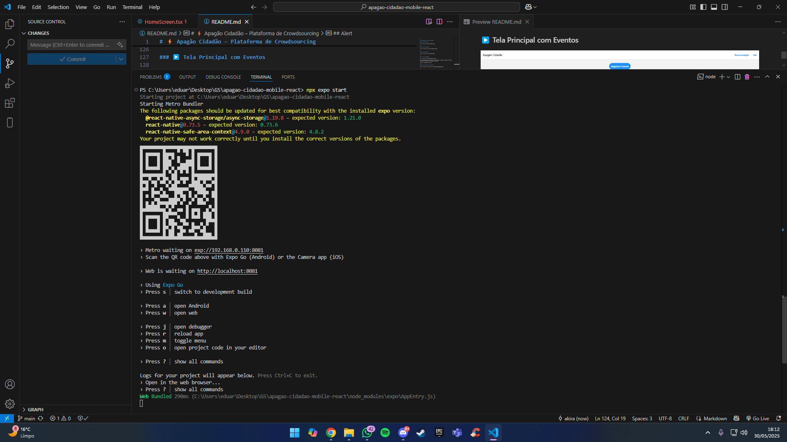
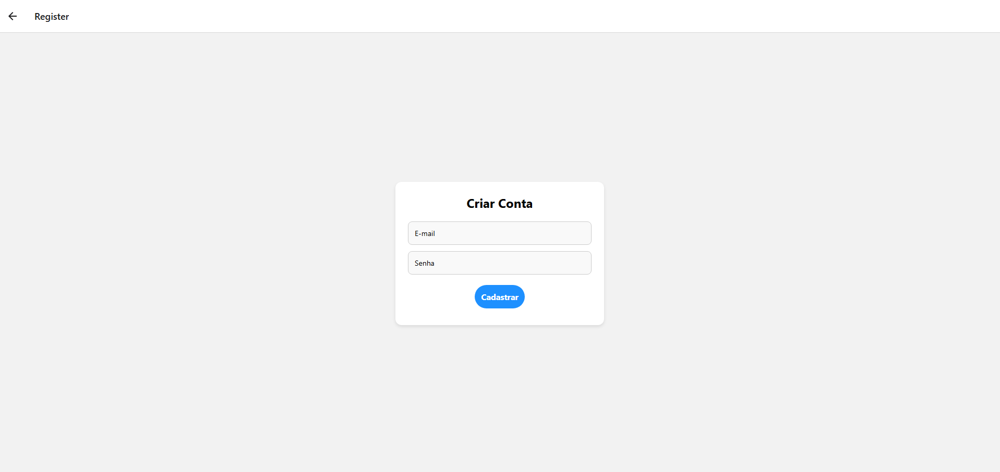
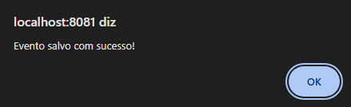
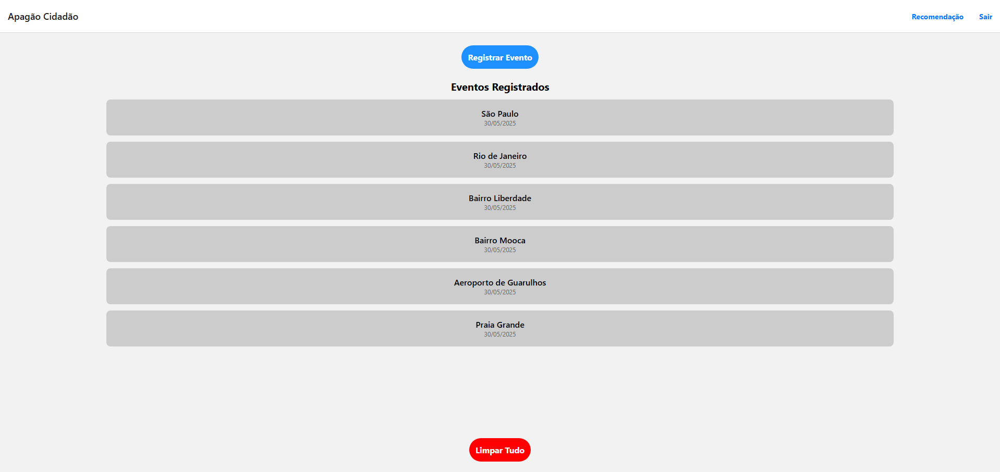
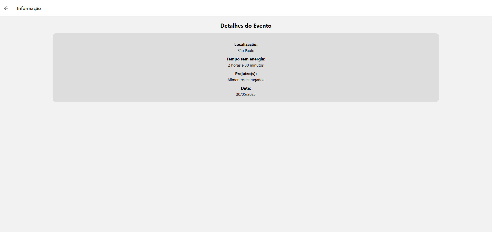
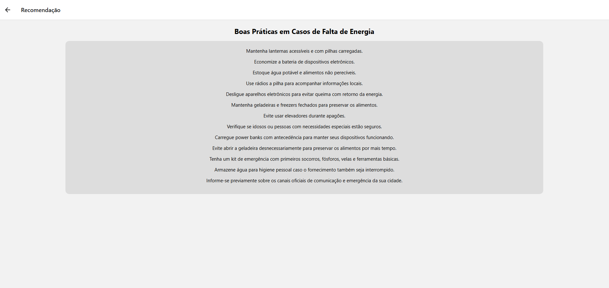

# Apagão Cidadão – Plataforma de Crowdsourcing

Este projeto é uma aplicação **React Native** com **AsyncStorage** que permite ao cidadão registrar e visualizar eventos de falta de energia elétrica. A ideia é fomentar um monitoramento colaborativo, possibilitando o mapeamento dos apagões por região, com dados como localização, duração, prejuízos e recomendações.

---

## 🤝 Autores

- Deivison Pertel (RM550803)
- Eduardo Akira Murata (RM98713)
- Wesley Souza de Oliveira (RM97874)

---

## 📱 Funcionalidades

- Autenticação com **Login e Cadastro**
- Registro de eventos de apagão:
  - Localização afetada
  - Tempo de interrupção
  - Prejuízos observados
- Recomendações para futuras situações
- Visualização de todos os eventos registrados
- Detalhamento de cada evento
- Tela de **Boas Práticas**
- Botão de logout funcional
- Armazenamento local usando **AsyncStorage**
- Interface compatível com **modo Web** (via Expo)

---

## 📂 Estrutura de Pastas

```
src/
├── components/           # Botões e componentes reutilizáveis
├── navigation/           # Rotas de navegação autenticadas e não autenticadas
├── screens/              # Telas principais do aplicativo
├── services/             # Serviços de autenticação e armazenamento
├── types/                # Tipagens compartilhadas
App.tsx                   # Entrada principal
```

---

## 🧪 Tecnologias Utilizadas

- React Native (Expo)
- TypeScript
- React Navigation
- AsyncStorage
- Expo CLI

---

## 🚀 Como Rodar Localmente

1. **Clone o repositório**:
   ```bash
   git clone https://github.com/seu-usuario/apagao-cidadao-mobile.git
   cd dwe-app-mobile-react
   ```

2. **Instale as dependências**:
   ```bash
   npm install
   ```

3. **Execute a aplicação**:
   ```bash
   npx expo start
   ```

4. Acesse pelo navegador o QR Code ou o localhost exibido.

---

## 🖼️ Telas Implementadas

- **Login / Cadastro**
- **Home** – Resumo dos eventos registrados
- **Cadastrar Evento** – Formulário completo: 
    - Registro da região atingida, 
    - Registro da duração da interrupção,
    - Campo descritivo dos danos
- **Detalhes** – Exibição detalhada dos dados
- **Recomendações** – Lista de boas práticas

---

## 🔐 Acesso e Sessão

- Após login ou cadastro, o token é armazenado localmente.
- O botão **Sair** apaga a sessão e redireciona automaticamente para a tela de login.

---

## 📷 Evidências de Funcionamento


### ▶️ Execução da aplicação



---

### ▶️ Tela de Login


---

### ▶️ Tela de Registro



---

### ▶️ Tela Principal


---

### ▶️ Tela de Cadastro


Obs: Sistema pensado em execução web (windows). Ao cadastrar eventos em geral, ele gera um Alert com um response, como esse:


---

### ▶️ Tela Principal com Eventos



---

### ▶️ Detalhamento do Evento



---

### ▶️ Tela de Recomendações



---

## 📝 Licença

Este projeto é acadêmico e sem fins lucrativos. Todos os direitos reservados aos autores.
