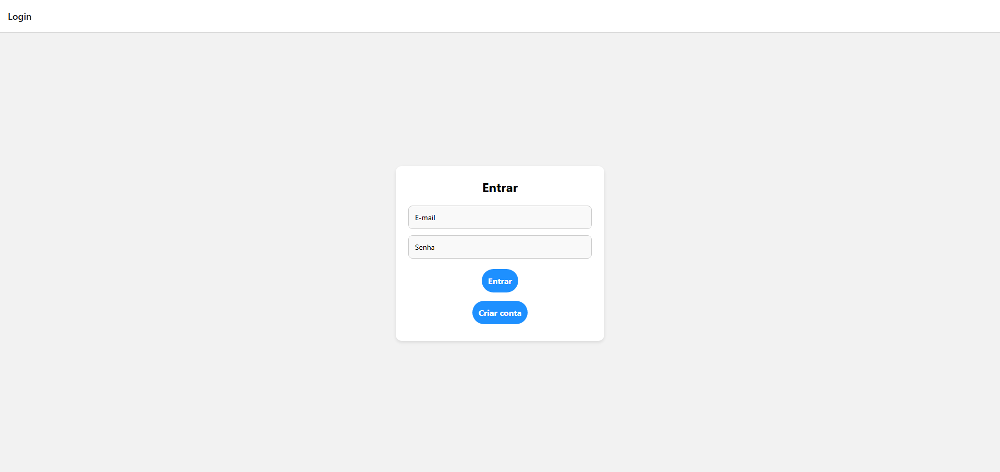
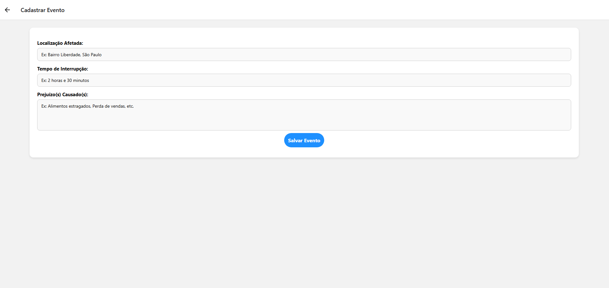
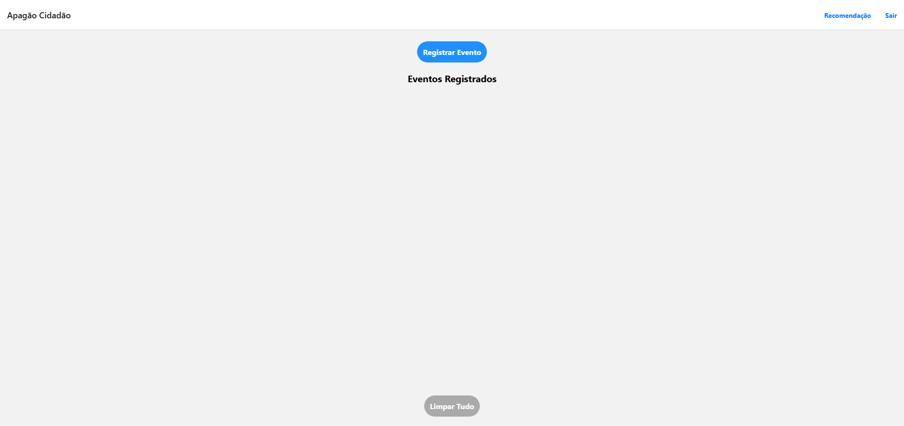
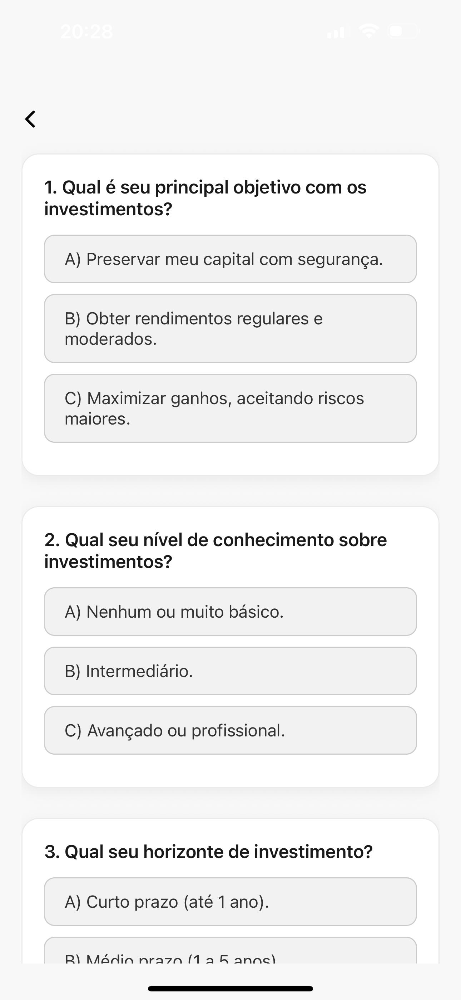
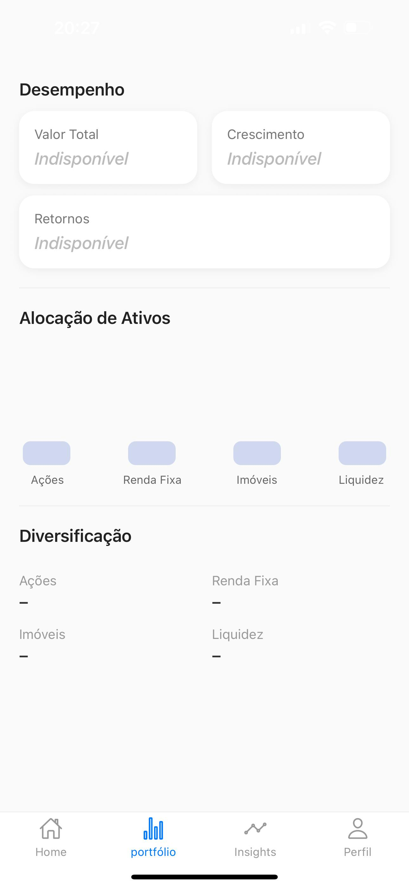
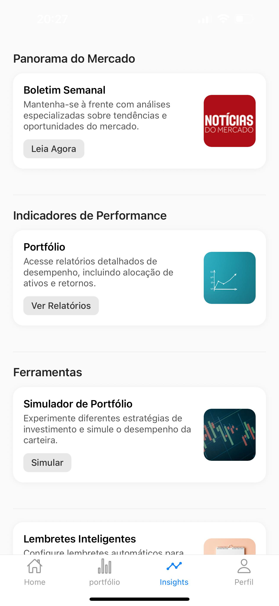
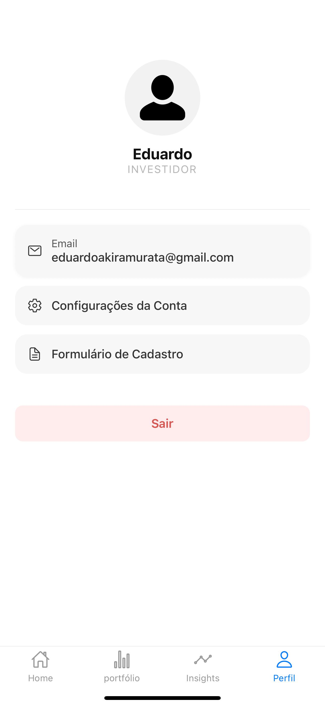
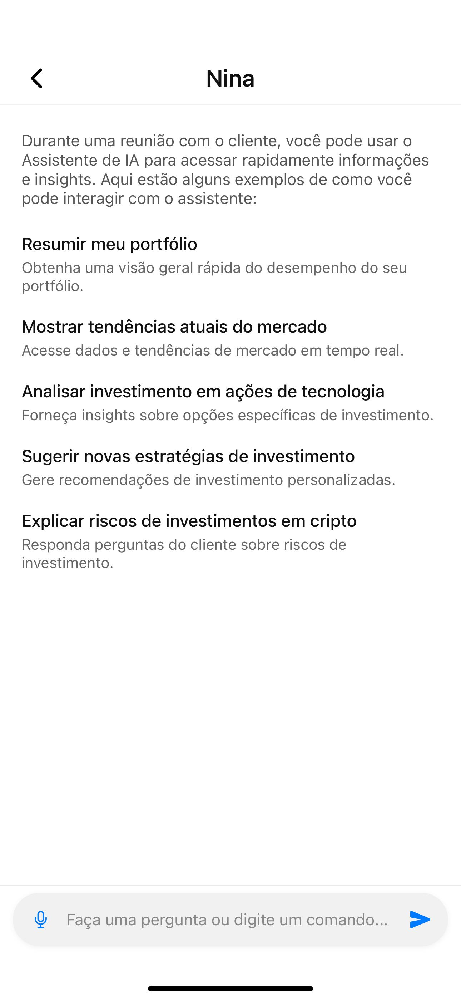

# Plataforma de Assessoria de Investimentos – App Mobile

Este projeto é uma aplicação **React Native** com **AsyncStorage** que oferece uma experiência completa para **investidores** e **assessores de investimentos**, com funcionalidades como teste de perfil de risco, acesso ao portfólio, atualizações de mercado, ferramentas interativas e suporte via IA.

---

## 🤝 Autores

- Eduardo Akira Murata (RM98713)
- Deivison Pertel (RM550803)
- Wesley Souza de Oliveira (RM97874)

---

## 📱 Funcionalidades

### Para investidores:
- Teste de perfil (Suitability) com retorno automático do perfil
- Visualização do portfólio com indicadores:
  - Valor total
  - Crescimento
  - Retorno percentual
  - Alocação por classe de ativos
- Acesso a insights de mercado com leitura de boletins
- Simulador de portfólio e lembretes inteligentes

### Para assessores:
- Tela de clientes
- Tela de investimentos
- Tela de configurações

### Recursos gerais:
- Login e cadastro com persistência de sessão (JWT via AsyncStorage)
- Navegação personalizada por tipo de perfil
- Design responsivo e moderno
- Separação de rotas autenticadas por perfil (Investidor ou Assessor)

---

## 📂 Estrutura de Pastas

```
src/
├── assets/               # Imagens e ícones usados nos cards e telas
├── components/           # Componentes reutilizáveis como botões
├── context/              # AuthContext para controle de login e perfil
├── navigation/           # Navegação por tabs e stacks
├── screens/              # Telas principais divididas por perfil
│   ├── investor/         # Telas específicas do investidor
│   ├── assessor/         # Telas do assessor de investimentos
│   ├── shared/           # Telas comuns como Login, Cadastro, Perfil
├── services/             # Serviços de autenticação e perfil de risco
├── utils/                # Funções utilitárias
App.tsx                   # Entrada principal da aplicação
```

---

## 🧪 Tecnologias Utilizadas

- React Native (Expo)
- TypeScript
- React Navigation
- AsyncStorage
- Expo CLI
- Axios
- API externa para avaliação de perfil de risco

---

## 🚀 Como Rodar Localmente

1. **Clone o repositório**:
   ```bash
   git clone https://github.com/seu-usuario/app-investimentos.git
   cd app-investimentos
   ```

2. **Instale as dependências**:
   ```bash
   npm install
   ```

3. **Execute a aplicação**:
   ```bash
   npx expo start
   ```

4. Escaneie o QR Code com o app do Expo Go ou acesse via navegador.

---

## 🖼️ Telas Implementadas

- **Login / Cadastro**
- **Dashboard Investidor** – Teste de perfil, IA, atualizações, investimentos
- **Perfil Investidor** – Formulário de perguntas com perfil calculado
- **Portfólio** – Dados visuais e analíticos do investidor
- **Insights** – Cards com boletins, relatórios e simulador
- **Perfil** – Dados pessoais, configurações e logout
- **Dashboard Assessor** – Home, clientes e gestão

---

## 🔐 Acesso e Sessão

- Após o login, o token é armazenado no dispositivo com **AsyncStorage**
- O botão **Sair** limpa a sessão e redireciona para o login automaticamente
- A navegação muda com base no perfil retornado pela API

---

## 📷 Evidências de Funcionamento

> As imagens podem ser adicionadas futuramente no diretório `/assets/` para ilustrar:

### ▶️ Tela de Login




---

### ▶️ Tela de Home (Investidor)



---

### ▶️ Teste de Perfil



---

### ▶️ Tela de Portfólio



---

### ▶️ Tela de Insights



---

### ▶️ Tela de Perfil



---

### ▶️ Tela de Chat - IA



---

## 📝 Licença

Este projeto é acadêmico e sem fins lucrativos. Todos os direitos reservados aos autores.
